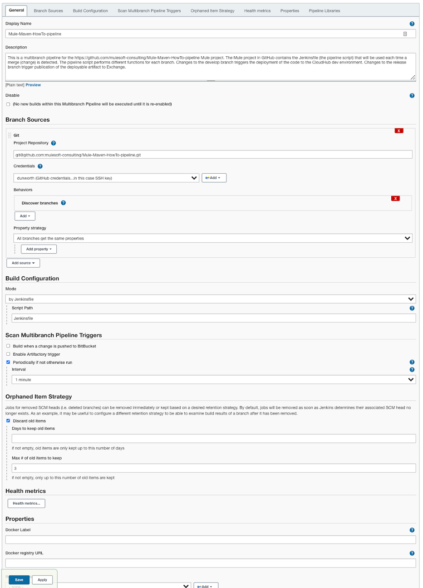

# Configuring the Jenkins Multibranch Pipeline

A Jenkins multibranch pipeline item is created for each Mule application inside a folder structure. Use the same name for the Mule artifactId, Git repository name and Jenkins multibranch pipeline item name. (The example project is named ‘Mule-Maven-HowTo-pipeline’ so create a Jenkins multibranch pipeline item named ‘Mule-Maven-HowTo-pipeline’.)

Create a multibranch pipeline: 

1. Login to Jenkins, 
2. Navigate to the folder where the item is to be created,
3. Select “New Item” from the menu,
4. Choose “Multibranch Pipeline” and give it the Mule project name. 

This shows how it looks:
 

